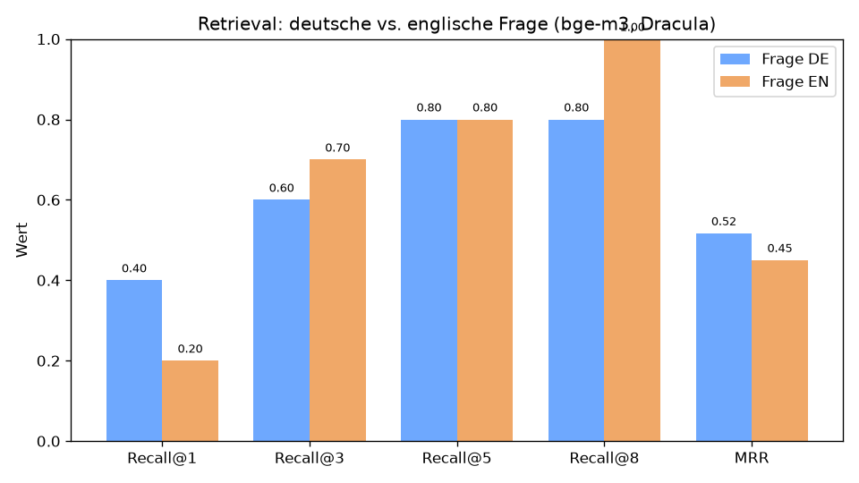
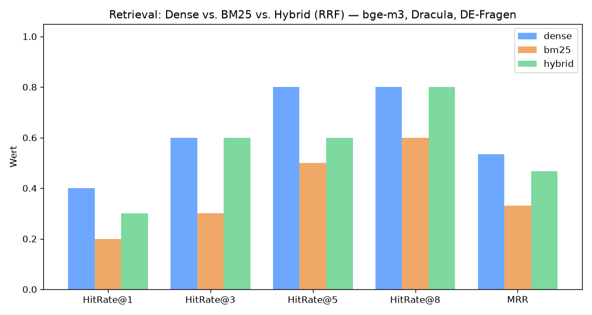
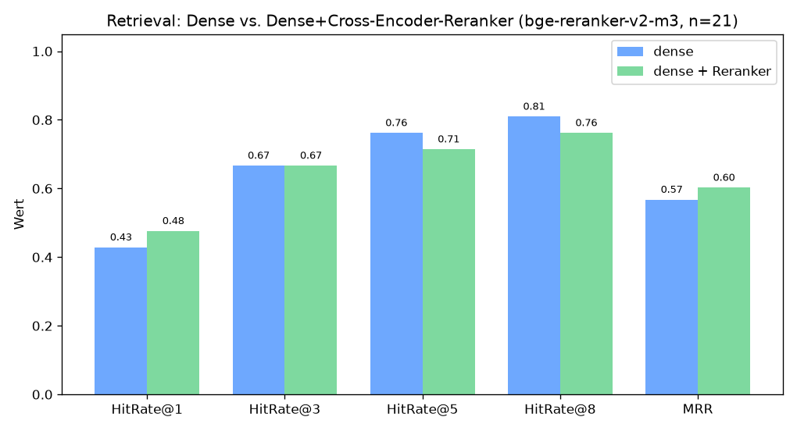

# Evaluations-Ergebnisse

Reproduzierbar via `make eval` (Baseline) bzw. den Experiment-Skripten in `eval/`.
Korpus: Dracula (581 Chunks), Embeddings `bge-m3`, Qdrant Cosine. Relevanz
**kapitel-basiert** (Gold-Set `eval/gold_dracula.jsonl`, inzwischen **n=21** Fragen;
die frühen Experimente unten liefen noch gegen n=10 — jeweils am Experiment vermerkt).

> **Metrik-Hinweis (Ehrlichkeit):** Was hier „Recall@k" heißt, ist faktisch
> **Hit-Rate@k / Success@k** — der Wert ist 1.0, sobald *irgendein* relevantes
> Kapitel in Top-k liegt (nicht der Deckungsgrad über alle Gold-Kapitel). Bei
> Multi-Kapitel-Fragen überschätzt das die Güte. Der Vergleich zwischen Methoden
> bleibt fair (für alle identisch berechnet).
>
> **Statistik-Hinweis:** n=10 ist ein exploratives **Dev-Set ohne Signifikanz**.
> Jede Frage bewegt Hit-Rate um 0.10; MRR-Standardfehler ~0.13. Aussagen sind
> Trends, keine belastbaren Rankings. Für belastbare Schlüsse: Gold-Set auf
> n≥30–50 vergrößern + Bootstrap-CI / paired Test.

## Baseline — dense (bge-m3), deutsche Fragen, k=8

| Metrik | Wert |
|---|---|
| Hit-Rate@1 | 0.40 |
| Hit-Rate@3 | 0.60 |
| Hit-Rate@5 | 0.80 |
| Hit-Rate@8 | 0.80 |
| MRR | 0.535 |

Misses (kein relevantes Kapitel in Top-8): **d01** (Harkers Reisegrund),
**d09** (Vampir-Abwehrmittel).

## Experiment 1 — Frage DE vs. EN (`eval/lang_experiment.py`)

**Hypothese:** Die mäßige Baseline liegt am cross-lingualen Gap (DE-Frage → EN-Text).

| Metrik | DE | EN | Δ |
|---|---|---|---|
| Hit-Rate@1 | 0.40 | 0.20 | −0.20 |
| Hit-Rate@3 | 0.60 | 0.70 | +0.10 |
| Hit-Rate@5 | 0.80 | 0.80 | 0.00 |
| Hit-Rate@8 | 0.80 | **1.00** | +0.20 |
| MRR | 0.517 | 0.450 | −0.067 |

**Ergebnis — Hypothese teilweise widerlegt:** `bge-m3` ist echt multilingual; DE
rankt den Top-Treffer sogar besser (Hit-Rate@1, MRR). EN hilft nur im Tail (die
Misses d01/d09 tauchen auf, aber erst auf Rang 8). → **Query-Übersetzung ist kein Fix.**

## Experiment 2 — Dense vs. BM25 vs. Hybrid/RRF (`eval/hybrid_experiment.py`)

**Idee:** BM25 (lexikalisch) matcht Eigennamen direkt; per Reciprocal Rank Fusion
(RRF, k=60, CAND=30) mit Dense kombiniert. Adversariell verifiziert (Panel aus 4
Skeptikern, Zahlen exakt reproduziert).

| Metrik | dense | bm25 | hybrid |
|---|---|---|---|
| Hit-Rate@1 | 0.40 | 0.20 | 0.30 |
| Hit-Rate@3 | 0.60 | 0.30 | 0.60 |
| Hit-Rate@5 | 0.80 | 0.50 | 0.60 |
| Hit-Rate@8 | 0.80 | 0.60 | 0.80 |
| MRR | 0.535 | 0.331 | 0.467 |

**Ehrliches Ergebnis (nach Verifikation):**
- **Naives RRF-Hybrid bringt bei n=10 KEINEN messbaren Netto-Vorteil** gegenüber
  Dense. Die gepaarte Reciprocal-Rank-Bilanz Dense↔Hybrid ist **4:4** (praktisch
  ein Münzwurf). Hybrid *rettet* einzelne Dense-Misses (d01: 10→6, d09: 12→1),
  *verschlechtert* aber einzelne Dense-Top-1-Treffer (d02: 4→16, d08: 1→9) —
  jeweils ~2 Fragen, nicht generalisierbar.
- **BM25 solo liegt durchgängig am niedrigsten** — aber im **Cross-Lingual-Handicap**
  (deutsche Frage gegen englischen Korpus). Das ist *kein* fairer BM25-Ceiling;
  BM25 gewinnt nur dort, wo seltene Eigennamen fallen (d03 „Demeter/Whitby", d06 „Westenra").
- „Dense ist am besten" wäre **überzogen** (bei n=10 nicht von Hybrid unterscheidbar).

**Struktureller Hinweis:** RRF fusioniert auf **Chunk**-Ebene, die Metrik ist
**Kapitel**-basiert — Dense und BM25 treffen dasselbe relevante Kapitel oft über
*verschiedene* Chunks, daher greift die RRF-Verstärkung kaum. Die „Verwässerung"
ist teils ein struktureller Effekt der Chunk-Fusion, nicht nur der Gleichgewichtung.

## Experiment 3 — Cross-Encoder-Reranker (`eval/reranker_experiment.py`)

Gold-Set auf **n=21** erweitert (Labels im Quelltext verankert). Dense holt 30
Kandidaten, `bge-reranker-v2-m3` (multilingual) sortiert neu.

| Metrik | dense | + Reranker | Δ |
|---|---|---|---|
| Hit-Rate@1 | 0.43 | **0.48** | +0.05 |
| Hit-Rate@3 | 0.67 | 0.67 | 0.00 |
| Hit-Rate@5 | 0.76 | 0.71 | −0.05 |
| Hit-Rate@8 | 0.81 | 0.76 | −0.05 |
| MRR | 0.567 | **0.602** | +0.035 |

**Ergebnis:** Der Reranker verbessert **Precision@1 und MRR** (bringt einen Treffer
nach vorn) — genau seine erwartete Stärke — verschlechtert aber die **Tail-Recall**
(@5/@8). Gepaarte Erst-Treffer-Bilanz 4:7 (dense), aber der Reranker gewinnt deutlicher,
wo er gewinnt (d21 15→2, d10 3→1, d06 4→1).

**Caveat (wichtig):** Die Metrik ist **kapitel-basiert**, der Cross-Encoder arbeitet
**passagen-basiert**. Er stuft „richtiges Kapitel, aber thematisch daneben"-Chunks
korrekt herab — die Kapitel-Metrik zählt das als Verlust (z. B. d02 4→26). Der Reranker
wird dadurch systematisch **unterbewertet**; für RAG zählt „bester Chunk zuerst"
(Precision@1/MRR), und das verbessert er. Faire Bewertung braucht **passagen-basierte
Gold-Labels**.

## Metrik-Suite — Antwortqualität + Serving (`eval/answer_eval.py`)

Pro Gold-Frage (n=21) wird die volle RAG-Pipeline ausgeführt (Modell `qwen2.5:7b`, k=8):

| Kategorie | Metrik | Wert (mean) |
|---|---|---|
| Antwort | ROUGE-L | 0.124 |
| Antwort | Antwort-Token-F1 | 0.153 |
| Antwort | **Faithfulness (NLI, mDeBERTa-xnli)** | **0.667** |
| Retrieval | Recall@8 | 0.770 |
| Retrieval | MRR | 0.556 |
| Serving | TTFT (median) | ~7.4 s\* |
| Serving | TPS (median) | 11.8 tok/s |
| Serving | e2e (median) | ~19 s |

\* TTFT im Batch-Lauf durch Speicherdruck/Modell-Reloads (24 GB) erhöht; interaktiv/warm ~0,2–4 s.

**Interpretation:**
- **ROUGE-L/F1 sind niedrig (~0.12–0.15), obwohl die Antworten korrekt sind** — sie messen nur
  n-Gramm-Überlappung mit einer kurzen Referenzantwort und bestrafen Paraphrasen. Für generatives
  RAG sind sie deshalb nur schwache Signale (nützlich als *relativer* Vergleich zwischen Modellen).
- **Faithfulness (NLI) = 0.667** ist das aussagekräftigere Maß: 2/3 der Antwort-Aussagen werden von
  den abgerufenen Passagen *gestützt* (Entailment). Die Lücke zeigt Raum nach oben (Retrieval-Gaps
  oder ungestützte Modell-Zusätze) — bewusst statt PPL gewählt, das nur Fluenz misst.
- Roh-Ergebnisse pro Frage: `results/answer_eval.json`.

## Exp 4 — Overlap-Dedup im Retrieval (`eval/dedup_experiment.py`)

**Frage:** Der Chunker arbeitet mit ~200 Zeichen Overlap — wie oft belegen dadurch
*dieselben* Passagen mehrere Top-k-Plätze, und was bringt Deduplizierung?

**Setup:** paired auf denselben 21 Fragen (Gruppe `Horror`, k=8, kapitel-basierte
Metrik wie Exp 1–3). Arme: `baseline` (Suche wie bisher) vs. `dedup` (k+8 Kandidaten
holen, überlappende Zeichenbereiche desselben Buchs deduplizieren, auf k kürzen).

| Messgröße | baseline | dedup |
|---|---|---|
| Fragen mit ≥1 Duplikat in Top-8 | 16/21 (Ø 1,33) | 0 |
| Ø verschiedene Kapitel in Top-8 | 4,71 | **5,52** |
| Hit-Rate@8 | 0,810 | **0,857** |
| MRR | 0,556 | **0,565** |

Gepaarte MRR-Bilanz: **2 besser / 0 schlechter / 19 gleich** — ein seltener Fall
ohne Downside: Duplikate raus = mehr *verschiedene* Information im Prompt, und in
2 Fällen rückt dadurch ein relevantes Kapitel neu in die Top-8. Der Haupteffekt
(mehr nutzbarer Kontext fürs LLM) liegt außerhalb dieser Retrieval-Metrik und
sollte sich in der Antwortqualität zeigen. **Konsequenz: Dedup ist in
`app/rag/retriever.py` produktiv aktiv** (Puffer `DEDUP_EXTRA=8`).

## Nächste Schritte

1. **Gold-Set v2 mit Span-Labels** (in Kuration, `notebooks/gold_set_v2.ipynb`):
   passagen-genaue Labels statt Kapitel (Ø 30,2 von 581 Chunks zählen unter einem
   Kapitel-Label als Treffer — die Metrik ist massiv zu gnädig), n≥30–50; danach
   `retrieval_eval.py` auf Span-Overlap umstellen (Kapitel-Arm als Vergleich behalten).
2. **Exp 5 — Contextual Retrieval:** LLM-generierter Chunk-Kontext beim Embedden
   (paired dense vs. dense+kontext).
3. **Exp 6 — Sparse-Hybrid** mit bge-m3-eigenen Sparse-Gewichten statt BM25
   (adressiert das cross-linguale Handicap aus Exp 2); dabei auch `bm25_en`-Arm.
4. Bootstrap-CI / paired Test, sobald n≥30.
5. ~~Reranker in die `/chat`-Pipeline integrieren~~ ✅ umgesetzt (opt-in via
   `RERANKER_ENABLED`, s. README).
